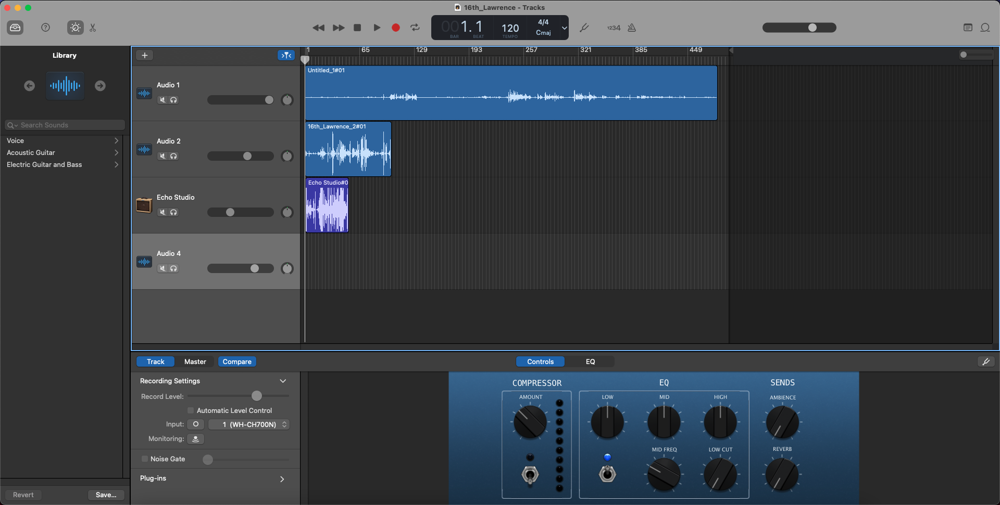
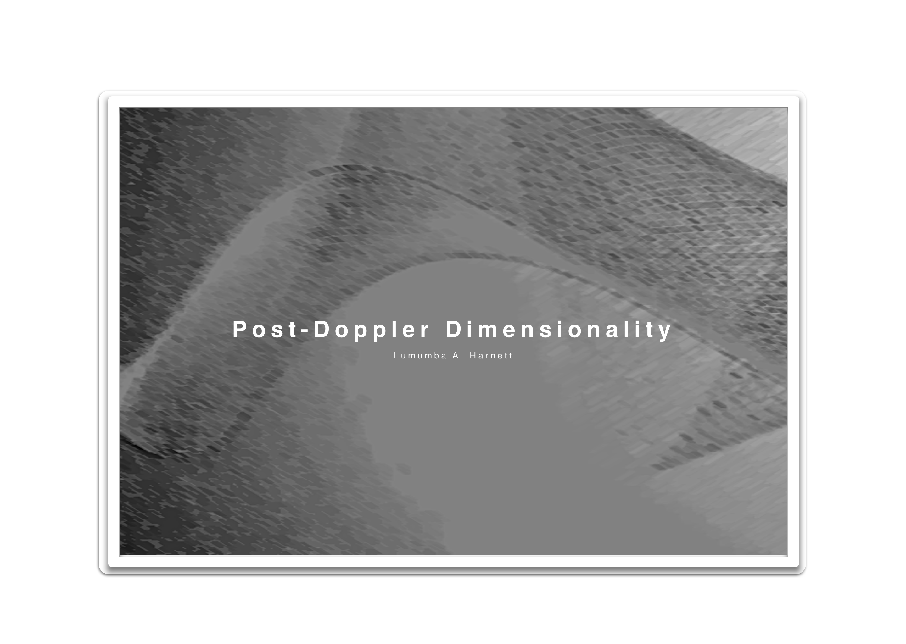
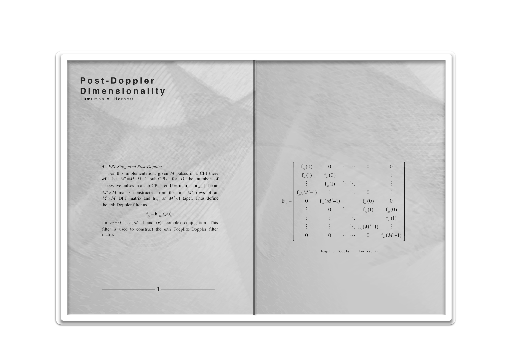
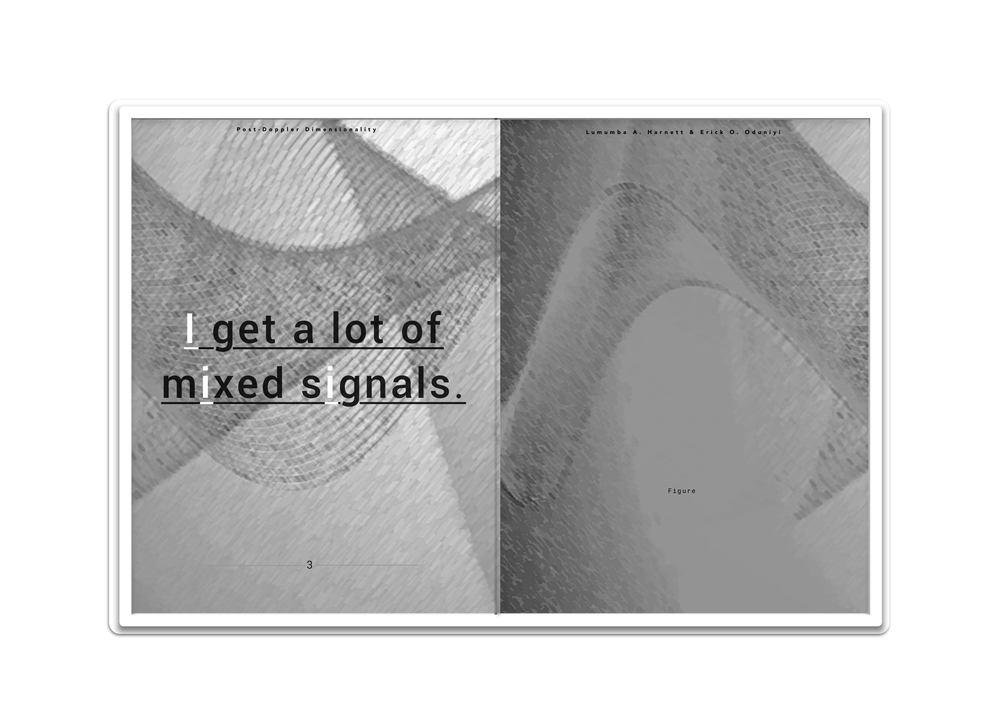

# eye_listen_4_love
International journal about signal processing in the state of the arts.

## Random Matrix Theory 4 Music
Signal processing researcher and artist [Lumumba A. Harnett](https://graduate.ku.edu/2014-chancellors-fellows) and [Erick O. Oduniyi](https://scholar.google.com/citations?user=1ApryN8AAAAJ&hl=en) are working through various music production pieces to better understand the underlying nature of doppler phenomena.

**Figure:** [Outside recording](https://light-systems.github.io/eye_listen_4_love/) of cars, animals, and the self in Lawrence, KS. Recording was done with assistance from Henry Kraujalis (rarebasil@gmail.com)

## Interfaces for Random Matrix Theory

